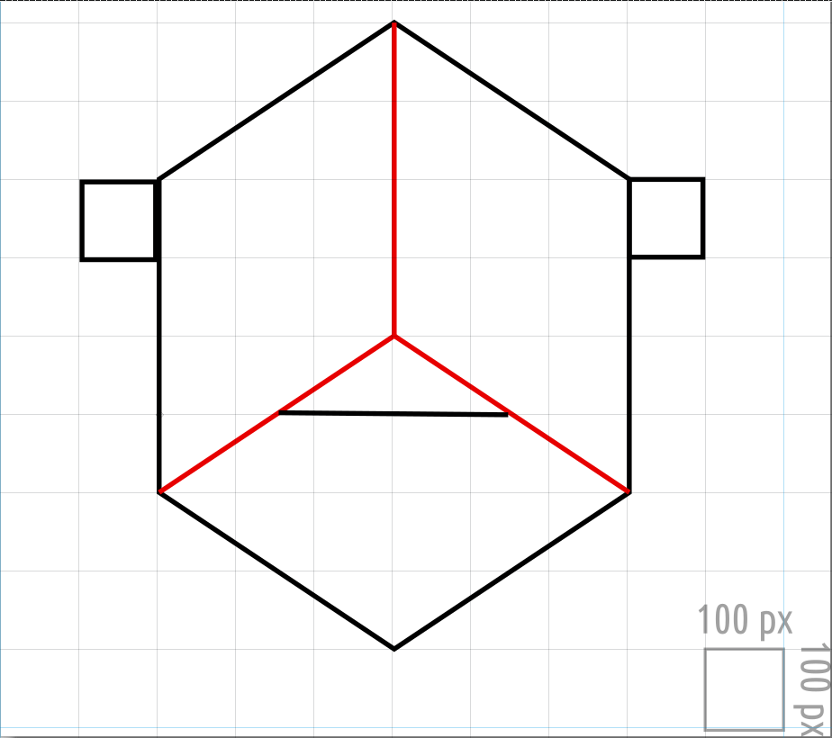

# Examen Visualdon - 25 juin 2025

Le travail sera rendu au plus tard à 16h15, par Teams.

Vous rendrez un **fichier ZIP** de tout votre projet excepté le dossier `node_modules` et vous donnerez votre nom de famille, prénom et classe à ce dossier (_nom_prenom_classe.zip_). Vous êtes responsable de son contenu et devez vous assurer de la bonne réception du dossier avant de quitter la salle.

Pour accéder à la version en ligne de la donnée de l'examen, visitez [https://github.com/romanoe/examen-visualdon-25/](https://github.com/romanoe/examen-visualdon-25/)

## Installation

Clonez ou téléchargez le zip de ce [dossier](<[https://github.com/romanoe/examen-visualdon-25/](https://github.com/romanoe/examen-visualdon-25/archive/refs/heads/main.zip)>)

-   **SSH**: `git clone git@github.com:romanoe/examen-visualdon-25.git`
-   ou **HTTPS**: `git clone https://github.com/romanoe/examen-visualdon-25.git`

Rentrez dans le dossier _examen-visualdon-25_ : `cd examen-visualdon-25`

Installez les packages nécessaires :

```bash
npm install
```

Démarrez le serveur :

```bash
npm run dev
```

Vous devriez avoir accès à votre serveur local sur [localhost:5173](http:localhost:5173)

Complétez les fichiers `index.html` et `src/index.js` afin de réaliser les exercices demandés.

\pagebreak

## Exercice 1 - SVG (15 points)

Reproduire le dessin suivant dans le navigateur à l’aide des outils que vous avez appris en cours.

La grille et la légende sont fournies à titre indicatif et ne doivent pas être dessinées.



\pagebreak

## Charge (passagers) sur le réseau ferroviaire suisse

### Données

Pour la suite des exercices, vous avez à disposition deux jeux de données, extraits de l'Office fédéral du développement territorial (ARE) et de l'Office fédéral de la topographie (swisstopo) :

1.  `data/cantons_average_daily_trafic.geojson` : Les limites des cantons avec la valeur de charge (passagers) sur le réseau ferroviaire suisse ainsi que la population de chaque canton
2.  `data/network_average_daily_trafic.geojson`: Les tronçons du chemin de fer suisse avec la valeur de charge (passagers) sur chaque segment

S'agissant de fichiers `geojson`, la composante géographique est directement dans les données (`geometry`). Les données sont structurées de la manière suivante :

#### `data/cantons_average_daily_trafic.geojson`

-   `id` : identifiant canton
-   `name`: nom du canton
-   `avg_daily_trafic` : charge moyenne de passagers par jour
-   `population` : population du canton

#### `data/network_average_daily_trafic.geojson`

-   `id` : identifiant tronçon
-   `avg_daily_trafic`: charge moyenne de passagers par jour

## Exercice 2 - Manipulations des données (15 points)

Apportez les manipulations suivantes et imprimez les résultats dans la console :

1. Le **canton** ayant la grande charge de passagers sur le réseau férroviaire (**5 points**)
2. Les **10 cantons** ayant la plus grande charge de passagers sur le réseau férroviaire (**5 points**)
3. Les données sur la charge de passagers par canton fournies par la Confédération sont-elles suffisamment représentatives pour comparer efficacement les cantons entre eux ? Quels éléments supplémentaires ou ajustements pourraient être nécessaires pour rendre ces comparaisons plus équitables et pertinentes ? (**5 points**)

## Exercice 3 - Visualisations (70 points)

Avec les données de l'exercice précédent, utilisez les outils que vous avez appris en cours pour créer les visualisations suivantes.

> **D3.js** et **Leaflet** sont déjà installés et importés dans `src/index.js` (à vous le choix d'utiliser l'un et/ou l'autre pour les exercices de cartographie). Si vous souhaitez utiliser une autre bibliothèque, vous devez l'installer à l'aide de `npm` et l'importer de la même manière.

### 3.1 Carte choroplète (25 points)

1. Visualisez une carte choroplète de toutes les cantons en fonction de la **nombre de passagers par 10'000 habitants**. (**10 points**)

2. Ajoutez une info-bulle qui affiche le **nom du canton** et le **nombre de passagers par 10'0000 habitants** lorsque survolées. De plus, augmentez l'épaisseur de la limite cantonale lors du survol. (**10 points**)

3. Intégrez un titre et une légende à la carte. (**5 points**)

### 3.2 Visualisation de la Charge de Passagers sur le Réseau Ferroviaire Suisse (25 points)

Nous allons reproduire une carte thématique où l'épaisseur et la couleur des lignes de chemin de fer varient en fonction de la charge de passagers, comme décrit ci-dessous :

1. Créez une carte du réseau ferroviaire suisse en utilisant les données disponibles dans `data/network_average_daily_trafic.geojson`. Représentez chaque ligne de chemin de fer sur la carte.
   Ajustez l'épaisseur des lignes en fonction de la charge de passagers sur chaque segment du réseau (exprimée en nombre de passagers). Plus la charge est élevée, plus la ligne doit être épaisse.
   Utilisez une échelle de couleurs pour représenter visuellement cette charge. (**10 points**)

2. Ajoutez une info-bulle qui s'affiche lorsque l'utilisateur survole une ligne ferroviaire avec la souris. Cette info-bulle doit indiquer la charge de passagers correspondante. (**10 points**)

3. Justifiez le choix de l'échelle utilisée pour l'épaisseur des lignes et les couleurs. Expliquez pourquoi cette échelle est appropriée pour représenter les données de charge de passagers. (**5 points**)

### 3.3 Diagramme en bâtons (20 points)

1. Créez un diagramme en bâton horizontal (horizontal barchart) des **10 cantons** ayant le plus grand nombre de charge de passagers par 10'000 habitants, avec en axe Y les **noms des cantons** et en axe X le **nombre de passagers par 10'000 habitants** (**15 points**)
2. Implémentez une animation d'entrée avec une fonction d'accélération de votre choix. (**5 points**)
